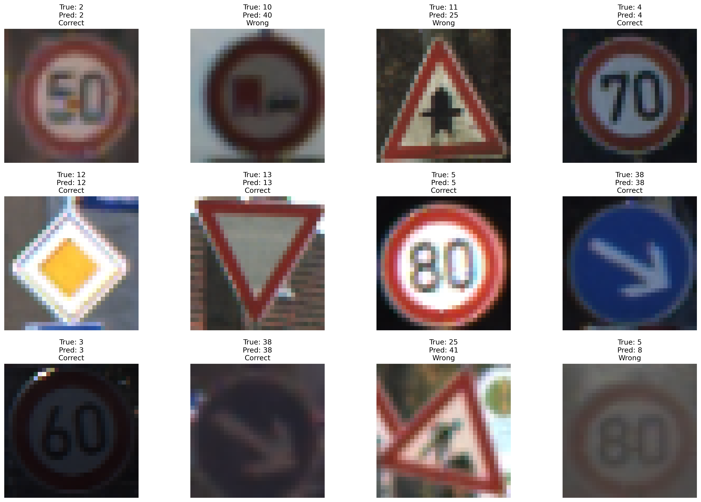

# Traffic Sign Detection (HOG + SVM) & LaTeX Manuscript



A complete machine learning pipeline and academic manuscript for traffic sign detection. This repository contains the source code for a Histogram of Oriented Gradients (HOG) and Support Vector Machine (SVM) based traffic sign detector, trained on the German Traffic Sign Recognition Benchmark (GTSRB), along with the accompanying LaTeX source code for the research paper.

## Key Features

- **HOG Feature Extraction**: Efficient sliding-window feature extraction using optimized HOG parameters.
- **SVM Classification**: A Linear SVM classifier trained to recognize 43 distinct traffic sign classes.
- **Jupyter Notebooks for EDA**: Exploratory data analysis (EDA) and experimental notebooks included for easy visualization.
- **Automated Figure Generation**: Python scripts that generate clean, high-resolution figures directly for the manuscript.
- **Overleaf-Ready LaTeX**: The manuscript is structured to compile seamlessly on Overleaf and local LaTeX distributions.

---

## Tech Stack

- **Machine Learning**: Python 3, scikit-learn, OpenCV, NumPy
- **Data Visualization**: Matplotlib, Seaborn
- **Document Formatting**: LaTeX (pdfTeX)
- **Environment**: Jupyter Notebooks

---

## Prerequisites

Before starting, ensure you have the following installed on your machine:

- **Python 3.8+**: [Download Python](https://www.python.org/downloads/)
- **TeX Live / MiKTeX**: Required for compiling the LaTeX manuscript locally.
- **Git**: For version control.

---

## Getting Started

Follow these steps to set up the repository for local development, run the ML pipeline, and compile the manuscript.

### 1. Clone the Repository

```bash
git clone https://github.com/nguyencongminh090/traffic-sign-detection-cpV.git
cd traffic-sign-detection-cpV
```

### 2. Set Up a Virtual Environment (Optional but Recommended)

```bash
python3 -m venv venv
source venv/bin/activate  # On Windows: venv\Scripts\activate
```

### 3. Install Python Dependencies

Create a `requirements.txt` if needed, or simply install the core libraries:

```bash
pip install numpy pandas scikit-learn opencv-python matplotlib seaborn jupyter
```

### 4. Dataset Setup

This project uses the **German Traffic Sign Recognition Benchmark (GTSRB)**.
1. Download the GTSRB dataset from the official source or Kaggle.
2. Extract the dataset into the `data/` directory at the root of the project.
   *(Note: The `data/` directory is ignored in Git to prevent large uploads).*

### 5. Running the ML Pipeline

You can explore the models and data interactively via the notebooks:

```bash
jupyter notebook src/notebooks/traffic_sign.ipynb
```

Alternatively, to generate the figures for the paper based on the saved model:

```bash
python src/scripts/generate_enhanced_figures.py
```

*(This script reads the models from the `models/` directory and outputs images to `figures/`)*.

### 6. Compiling the LaTeX Manuscript

You can compile the paper locally using `pdflatex`:

```bash
pdflatex main.tex
# Run twice to resolve cross-references and citations
pdflatex main.tex
```

Alternatively, upload the provided `CPV_Submission_Overleaf.zip` directly to [Overleaf](https://www.overleaf.com/) to compile without local LaTeX dependencies.

---

## Architecture Overview

### Directory Structure

```text
├── src/                    # Source Code
│   ├── scripts/            # Executable Python scripts
│   │   ├── generate_enhanced_figures.py
│   │   └── ...
│   └── notebooks/          # Jupyter Notebooks for EDA and prototyping
│       ├── data_overview.ipynb
│       └── traffic_sign.ipynb
├── models/                 # Serialized ML artifacts (Ignored in Git, except samples)
│   ├── hog_svm_gtsrb_model.pkl
│   └── gtsrb_hog_32x32_train_features.npz
├── data/                   # Raw GTSRB dataset (Ignored in Git)
├── figures/                # Output images consumed by the LaTeX manuscript
├── main.tex                # Core LaTeX manuscript file
├── .gitignore              # Defines ignored files/folders
└── CPV_Submission_Overleaf.zip # Packaged version for Overleaf
```

### The Machine Learning Pipeline

1. **Preprocessing**: Images from `data/` are resized to a fixed window (e.g., 32x32) and optionally converted to grayscale.
2. **Feature Extraction**: HOG features are extracted. Due to computational size, training features are serialized into `models/gtsrb_hog_32x32_train_features.npz`.
3. **Training**: A Linear SVM (`sklearn.svm.LinearSVC`) is trained on the HOG features. The trained model is pickled to `models/hog_svm_gtsrb_model.pkl`.
4. **Evaluation**: The scripts evaluate the model, generating confusion matrices, feature heatmaps, and detection bounding boxes.
5. **Figure Generation**: `generate_enhanced_figures.py` programmatically outputs the evaluation graphics directly into the `figures/` folder.

### The LaTeX Document Lifecycle

1. `main.tex` includes images via `\includegraphics{figures/...}`.
2. References are maintained via a strict `thebibliography` block at the end of the file.
3. The document is compiled with `pdflatex` to output `main.pdf`.

---

## Available Scripts

| Script | Location | Description |
|--------|----------|-------------|
| `traffic_sign.ipynb` | `src/notebooks/` | Core experimental notebook for model training. |
| `data_overview.ipynb` | `src/notebooks/` | Exploratory data analysis of the GTSRB dataset. |
| `generate_enhanced_figures.py` | `src/scripts/` | Renders high-quality plots and detection examples. |
| `pdflatex main.tex` | `(Root)` | Compiles the LaTeX document to PDF. |

---

## Troubleshooting

### LaTeX Compilation Errors

**Error:** `! LaTeX Error: File \`figures/some_image.png\` not found.`
**Solution:** Run the Python figure generation scripts first.
```bash
python src/scripts/generate_enhanced_figures.py
```

**Error:** `LaTeX Warning: Citation 'XYZ' on page N undefined` or `??` appears in PDF.
**Solution:** LaTeX requires multiple passes to resolve cross-references. Run `pdflatex main.tex` a second time.

### Python / ML Errors

**Error:** `FileNotFoundError: [Errno 2] No such file or directory: 'models/hog_svm_gtsrb_model.pkl'`
**Solution:** The model files might be missing (they are large and excluded from git). Run the `traffic_sign.ipynb` notebook end-to-end to generate and save the model file locally.

**Error:** `ModuleNotFoundError: No module named 'cv2'`
**Solution:** Install OpenCV via pip:
```bash
pip install opencv-python
```
