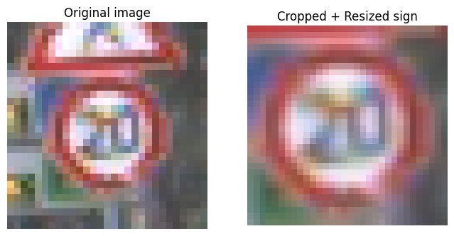
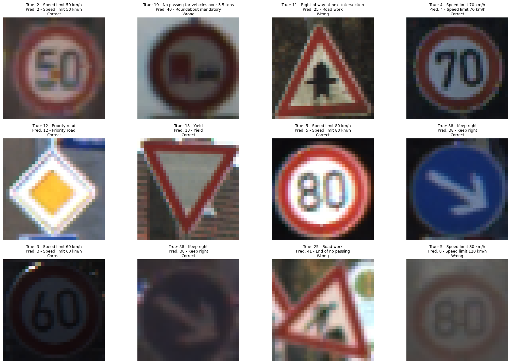
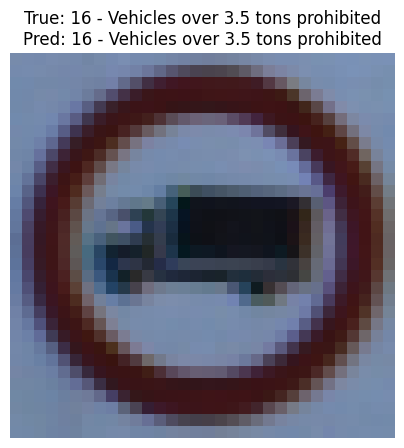

```python
!mkdir -p data

!wget -P data https://sid.erda.dk/public/archives/daaeac0d7ce1152aea9b61d9f1e19370/GTSRB_Final_Training_Images.zip
!wget -P data https://sid.erda.dk/public/archives/daaeac0d7ce1152aea9b61d9f1e19370/GTSRB_Final_Test_Images.zip
!wget -P data https://sid.erda.dk/public/archives/daaeac0d7ce1152aea9b61d9f1e19370/GTSRB_Final_Test_GT.zip
```

    --2026-07-13 02:29:14--  https://sid.erda.dk/public/archives/daaeac0d7ce1152aea9b61d9f1e19370/GTSRB_Final_Training_Images.zip
    Resolving sid.erda.dk (sid.erda.dk)... 130.225.104.13
    Connecting to sid.erda.dk (sid.erda.dk)|130.225.104.13|:443... connected.
    HTTP request sent, awaiting response... 200 OK
    Length: 276294756 (263M) [application/zip]
    Saving to: ‘data/GTSRB_Final_Training_Images.zip’
    
    GTSRB_Final_Trainin 100%[===================>] 263.50M  19.4MB/s    in 15s     
    
    2026-07-13 02:29:29 (17.6 MB/s) - ‘data/GTSRB_Final_Training_Images.zip’ saved [276294756/276294756]
    
    --2026-07-13 02:29:29--  https://sid.erda.dk/public/archives/daaeac0d7ce1152aea9b61d9f1e19370/GTSRB_Final_Test_Images.zip
    Resolving sid.erda.dk (sid.erda.dk)... 130.225.104.13
    Connecting to sid.erda.dk (sid.erda.dk)|130.225.104.13|:443... connected.
    HTTP request sent, awaiting response... 200 OK
    Length: 88978620 (85M) [application/zip]
    Saving to: ‘data/GTSRB_Final_Test_Images.zip’
    
    GTSRB_Final_Test_Im 100%[===================>]  84.86M  10.8MB/s    in 8.5s    
    
    2026-07-13 02:29:38 (10.0 MB/s) - ‘data/GTSRB_Final_Test_Images.zip’ saved [88978620/88978620]
    
    --2026-07-13 02:29:38--  https://sid.erda.dk/public/archives/daaeac0d7ce1152aea9b61d9f1e19370/GTSRB_Final_Test_GT.zip
    Resolving sid.erda.dk (sid.erda.dk)... 130.225.104.13
    Connecting to sid.erda.dk (sid.erda.dk)|130.225.104.13|:443... connected.
    HTTP request sent, awaiting response... 200 OK
    Length: 99620 (97K) [application/zip]
    Saving to: ‘data/GTSRB_Final_Test_GT.zip’
    
    GTSRB_Final_Test_GT 100%[===================>]  97.29K   356KB/s    in 0.3s    
    
    2026-07-13 02:29:39 (356 KB/s) - ‘data/GTSRB_Final_Test_GT.zip’ saved [99620/99620]
    


```python
!mkdir -p data

!unzip -q -n data/GTSRB_Final_Training_Images.zip -d data
!unzip -q -n data/GTSRB_Final_Test_Images.zip -d data
!unzip -q -n data/GTSRB_Final_Test_GT.zip -d data
```


```python
!find data -maxdepth 4 -type d | head -20
```

    data
    data/GTSRB
    data/GTSRB/Final_Training
    data/GTSRB/Final_Training/Images
    data/GTSRB/Final_Training/Images/00030
    data/GTSRB/Final_Training/Images/00005
    data/GTSRB/Final_Training/Images/00008
    data/GTSRB/Final_Training/Images/00021
    data/GTSRB/Final_Training/Images/00025
    data/GTSRB/Final_Training/Images/00032
    data/GTSRB/Final_Training/Images/00023
    data/GTSRB/Final_Training/Images/00033
    data/GTSRB/Final_Training/Images/00018
    data/GTSRB/Final_Training/Images/00034
    data/GTSRB/Final_Training/Images/00019
    data/GTSRB/Final_Training/Images/00006
    data/GTSRB/Final_Training/Images/00007
    data/GTSRB/Final_Training/Images/00037
    data/GTSRB/Final_Training/Images/00010
    data/GTSRB/Final_Training/Images/00002


```python
import os
import glob
import cv2
import numpy as np
import pandas as pd

from tqdm import tqdm
from skimage.feature import hog

from sklearn.model_selection import train_test_split
from sklearn.pipeline import make_pipeline
from sklearn.preprocessing import StandardScaler
from sklearn.svm import LinearSVC
from sklearn.metrics import accuracy_score, classification_report, confusion_matrix
```


```python
TRAIN_DIR = "/content/data/GTSRB/Final_Training/Images"
TEST_DIR = "/content/data/GTSRB/Final_Test/Images"

print("Train exists:", os.path.exists(TRAIN_DIR))
print("Test exists:", os.path.exists(TEST_DIR))
```

    Train exists: True
    Test exists: True


```python
csv_files = sorted(glob.glob(os.path.join(TRAIN_DIR, "*", "GT-*.csv")))

print("Số file CSV label:", len(csv_files))
print(csv_files[:5])
```

    Số file CSV label: 43
    ['/content/data/GTSRB/Final_Training/Images/00000/GT-00000.csv', '/content/data/GTSRB/Final_Training/Images/00001/GT-00001.csv', '/content/data/GTSRB/Final_Training/Images/00002/GT-00002.csv', '/content/data/GTSRB/Final_Training/Images/00003/GT-00003.csv', '/content/data/GTSRB/Final_Training/Images/00004/GT-00004.csv']


```python
sample_csv = csv_files[0]
df_sample = pd.read_csv(sample_csv, sep=";")

print(sample_csv)
df_sample.head()
```

    /content/data/GTSRB/Final_Training/Images/00000/GT-00000.csv


  <div id="df-2fa3c3be-d620-492f-b4dd-a78a53f54f6e" class="colab-df-container">
    <div>
<style scoped>
    .dataframe tbody tr th:only-of-type {
        vertical-align: middle;
    }

    .dataframe tbody tr th {
        vertical-align: top;
    }

    .dataframe thead th {
        text-align: right;
    }
</style>
<table border="1" class="dataframe">
  <thead>
    <tr style="text-align: right;">
      <th></th>
      <th>Filename</th>
      <th>Width</th>
      <th>Height</th>
      <th>Roi.X1</th>
      <th>Roi.Y1</th>
      <th>Roi.X2</th>
      <th>Roi.Y2</th>
      <th>ClassId</th>
    </tr>
  </thead>
  <tbody>
    <tr>
      <th>0</th>
      <td>00000_00000.ppm</td>
      <td>29</td>
      <td>30</td>
      <td>5</td>
      <td>6</td>
      <td>24</td>
      <td>25</td>
      <td>0</td>
    </tr>
    <tr>
      <th>1</th>
      <td>00000_00001.ppm</td>
      <td>30</td>
      <td>30</td>
      <td>5</td>
      <td>5</td>
      <td>25</td>
      <td>25</td>
      <td>0</td>
    </tr>
    <tr>
      <th>2</th>
      <td>00000_00002.ppm</td>
      <td>30</td>
      <td>30</td>
      <td>5</td>
      <td>5</td>
      <td>25</td>
      <td>25</td>
      <td>0</td>
    </tr>
    <tr>
      <th>3</th>
      <td>00000_00003.ppm</td>
      <td>31</td>
      <td>31</td>
      <td>5</td>
      <td>5</td>
      <td>26</td>
      <td>26</td>
      <td>0</td>
    </tr>
    <tr>
      <th>4</th>
      <td>00000_00004.ppm</td>
      <td>30</td>
      <td>32</td>
      <td>5</td>
      <td>6</td>
      <td>25</td>
      <td>26</td>
      <td>0</td>
    </tr>
  </tbody>
</table>
</div>
    <div class="colab-df-buttons">

  <div class="colab-df-container">
    <button class="colab-df-convert" onclick="convertToInteractive('df-2fa3c3be-d620-492f-b4dd-a78a53f54f6e')"
            title="Convert this dataframe to an interactive table."
            style="display:none;">

  <svg xmlns="http://www.w3.org/2000/svg" height="24px" viewBox="0 -960 960 960">
    <path d="M120-120v-720h720v720H120Zm60-500h600v-160H180v160Zm220 220h160v-160H400v160Zm0 220h160v-160H400v160ZM180-400h160v-160H180v160Zm440 0h160v-160H620v160ZM180-180h160v-160H180v160Zm440 0h160v-160H620v160Z"/>
  </svg>
    </button>

  <style>
    .colab-df-container {
      display:flex;
      gap: 12px;
    }

    .colab-df-convert {
      background-color: #E8F0FE;
      border: none;
      border-radius: 50%;
      cursor: pointer;
      display: none;
      fill: #1967D2;
      height: 32px;
      padding: 0 0 0 0;
      width: 32px;
    }

    .colab-df-convert:hover {
      background-color: #E2EBFA;
      box-shadow: 0px 1px 2px rgba(60, 64, 67, 0.3), 0px 1px 3px 1px rgba(60, 64, 67, 0.15);
      fill: #174EA6;
    }

    .colab-df-buttons div {
      margin-bottom: 4px;
    }

    [theme=dark] .colab-df-convert {
      background-color: #3B4455;
      fill: #D2E3FC;
    }

    [theme=dark] .colab-df-convert:hover {
      background-color: #434B5C;
      box-shadow: 0px 1px 3px 1px rgba(0, 0, 0, 0.15);
      filter: drop-shadow(0px 1px 2px rgba(0, 0, 0, 0.3));
      fill: #FFFFFF;
    }
  </style>

    <script>
      const buttonEl =
        document.querySelector('#df-2fa3c3be-d620-492f-b4dd-a78a53f54f6e button.colab-df-convert');
      buttonEl.style.display =
        google.colab.kernel.accessAllowed ? 'block' : 'none';

      async function convertToInteractive(key) {
        const element = document.querySelector('#df-2fa3c3be-d620-492f-b4dd-a78a53f54f6e');
        const dataTable =
          await google.colab.kernel.invokeFunction('convertToInteractive',
                                                    [key], {});
        if (!dataTable) return;

        const docLinkHtml = 'Like what you see? Visit the ' +
          '<a target="_blank" href=https://colab.research.google.com/notebooks/data_table.ipynb>data table notebook</a>'
          + ' to learn more about interactive tables.';
        element.innerHTML = '';
        dataTable['output_type'] = 'display_data';
        await google.colab.output.renderOutput(dataTable, element);
        const docLink = document.createElement('div');
        docLink.innerHTML = docLinkHtml;
        element.appendChild(docLink);
      }
    </script>
  </div>


    </div>
  </div>


```python
IMG_SIZE = (32, 32)

def extract_hog_feature(image_path, roi=None):
    # Đọc ảnh bằng OpenCV
    img = cv2.imread(image_path)

    if img is None:
        return None

    # OpenCV đọc ảnh dạng BGR, đổi sang RGB
    img = cv2.cvtColor(img, cv2.COLOR_BGR2RGB)

    # Nếu có ROI thì crop đúng vùng biển báo
    if roi is not None:
        x1, y1, x2, y2 = roi
        img = img[y1:y2+1, x1:x2+1]

    # Resize ảnh về cùng kích thước
    img = cv2.resize(img, IMG_SIZE)

    # HOG thường dùng ảnh grayscale
    gray = cv2.cvtColor(img, cv2.COLOR_RGB2GRAY)

    # Extract HOG feature
    feature = hog(
        gray,
        orientations=9,
        pixels_per_cell=(8, 8),
        cells_per_block=(2, 2),
        block_norm="L2-Hys",
        feature_vector=True
    )

    return feature.astype("float32")
```


```python
sample_csv = csv_files[0]
df_sample = pd.read_csv(sample_csv, sep=";")

sample_row = df_sample.iloc[0]
sample_folder = os.path.dirname(sample_csv)
sample_image_path = os.path.join(sample_folder, sample_row["Filename"])

roi = (
    int(sample_row["Roi.X1"]),
    int(sample_row["Roi.Y1"]),
    int(sample_row["Roi.X2"]),
    int(sample_row["Roi.Y2"])
)

feature = extract_hog_feature(sample_image_path, roi)

print("Image path:", sample_image_path)
print("ClassId:", sample_row["ClassId"])
print("HOG feature shape:", feature.shape)
print("First 10 values:", feature[:10])
```

    Image path: /content/data/GTSRB/Final_Training/Images/00000/00000_00000.ppm
    ClassId: 0
    HOG feature shape: (324,)
    First 10 values: [0.03778902 0.03286696 0.02817982 0.09768153 0.32963112 0.12780431
     0.01549799 0.02103676 0.01497179 0.01719324]


```python
import matplotlib.pyplot as plt

img = cv2.imread(sample_image_path)
img = cv2.cvtColor(img, cv2.COLOR_BGR2RGB)

x1, y1, x2, y2 = roi
crop = img[y1:y2+1, x1:x2+1]
crop_resized = cv2.resize(crop, IMG_SIZE)

plt.figure(figsize=(8, 4))

plt.subplot(1, 2, 1)
plt.imshow(img)
plt.title("Original image")
plt.axis("off")

plt.subplot(1, 2, 2)
plt.imshow(crop_resized)
plt.title("Cropped + Resized sign")
plt.axis("off")

plt.show()
```


    

    


```python
X = []
y = []

for csv_path in tqdm(csv_files):
    class_folder = os.path.dirname(csv_path)
    df = pd.read_csv(csv_path, sep=";")

    for _, row in df.iterrows():
        image_path = os.path.join(class_folder, row["Filename"])

        roi = (
            int(row["Roi.X1"]),
            int(row["Roi.Y1"]),
            int(row["Roi.X2"]),
            int(row["Roi.Y2"])
        )

        feature = extract_hog_feature(image_path, roi)

        if feature is not None:
            X.append(feature)
            y.append(int(row["ClassId"]))

X = np.array(X)
y = np.array(y)

print("X shape:", X.shape)
print("y shape:", y.shape)
print("Number of classes:", len(np.unique(y)))
```

    100%|██████████| 43/43 [00:30<00:00,  1.42it/s]


    X shape: (39209, 324)
    y shape: (39209,)
    Number of classes: 43


```python
np.savez(
    "/content/gtsrb_hog_32x32_train_features.npz",
    X=X,
    y=y
)

print("Saved HOG features successfully!")
```

    Saved HOG features successfully!


```python
from sklearn.model_selection import train_test_split

X_train, X_val, y_train, y_val = train_test_split(
    X,
    y,
    test_size=0.2,
    random_state=42,
    stratify=y
)

print("X_train:", X_train.shape)
print("X_val:", X_val.shape)
print("y_train:", y_train.shape)
print("y_val:", y_val.shape)
```


    ---------------------------------------------------------------------------

    NameError                                 Traceback (most recent call last)

    /tmp/ipykernel_721/2925173854.py in <cell line: 0>()
          2 
          3 X_train, X_val, y_train, y_val = train_test_split(
    ----> 4     X,
          5     y,
          6     test_size=0.2,


    NameError: name 'X' is not defined


```python
from sklearn.pipeline import make_pipeline
from sklearn.preprocessing import StandardScaler
from sklearn.svm import LinearSVC

model = make_pipeline(
    StandardScaler(),
    LinearSVC(
        C=1.0,
        class_weight="balanced",
        max_iter=10000,
        dual=False,
        random_state=42
    )
)

model.fit(X_train, y_train)
```


<style>#sk-container-id-1 {
  /* Definition of color scheme common for light and dark mode */
  --sklearn-color-text: #000;
  --sklearn-color-text-muted: #666;
  --sklearn-color-line: gray;
  /* Definition of color scheme for unfitted estimators */
  --sklearn-color-unfitted-level-0: #fff5e6;
  --sklearn-color-unfitted-level-1: #f6e4d2;
  --sklearn-color-unfitted-level-2: #ffe0b3;
  --sklearn-color-unfitted-level-3: chocolate;
  /* Definition of color scheme for fitted estimators */
  --sklearn-color-fitted-level-0: #f0f8ff;
  --sklearn-color-fitted-level-1: #d4ebff;
  --sklearn-color-fitted-level-2: #b3dbfd;
  --sklearn-color-fitted-level-3: cornflowerblue;

  /* Specific color for light theme */
  --sklearn-color-text-on-default-background: var(--sg-text-color, var(--theme-code-foreground, var(--jp-content-font-color1, black)));
  --sklearn-color-background: var(--sg-background-color, var(--theme-background, var(--jp-layout-color0, white)));
  --sklearn-color-border-box: var(--sg-text-color, var(--theme-code-foreground, var(--jp-content-font-color1, black)));
  --sklearn-color-icon: #696969;

  @media (prefers-color-scheme: dark) {
    /* Redefinition of color scheme for dark theme */
    --sklearn-color-text-on-default-background: var(--sg-text-color, var(--theme-code-foreground, var(--jp-content-font-color1, white)));
    --sklearn-color-background: var(--sg-background-color, var(--theme-background, var(--jp-layout-color0, #111)));
    --sklearn-color-border-box: var(--sg-text-color, var(--theme-code-foreground, var(--jp-content-font-color1, white)));
    --sklearn-color-icon: #878787;
  }
}

#sk-container-id-1 {
  color: var(--sklearn-color-text);
}

#sk-container-id-1 pre {
  padding: 0;
}

#sk-container-id-1 input.sk-hidden--visually {
  border: 0;
  clip: rect(1px 1px 1px 1px);
  clip: rect(1px, 1px, 1px, 1px);
  height: 1px;
  margin: -1px;
  overflow: hidden;
  padding: 0;
  position: absolute;
  width: 1px;
}

#sk-container-id-1 div.sk-dashed-wrapped {
  border: 1px dashed var(--sklearn-color-line);
  margin: 0 0.4em 0.5em 0.4em;
  box-sizing: border-box;
  padding-bottom: 0.4em;
  background-color: var(--sklearn-color-background);
}

#sk-container-id-1 div.sk-container {
  /* jupyter's `normalize.less` sets `[hidden] { display: none; }`
     but bootstrap.min.css set `[hidden] { display: none !important; }`
     so we also need the `!important` here to be able to override the
     default hidden behavior on the sphinx rendered scikit-learn.org.
     See: https://github.com/scikit-learn/scikit-learn/issues/21755 */
  display: inline-block !important;
  position: relative;
}

#sk-container-id-1 div.sk-text-repr-fallback {
  display: none;
}

div.sk-parallel-item,
div.sk-serial,
div.sk-item {
  /* draw centered vertical line to link estimators */
  background-image: linear-gradient(var(--sklearn-color-text-on-default-background), var(--sklearn-color-text-on-default-background));
  background-size: 2px 100%;
  background-repeat: no-repeat;
  background-position: center center;
}

/* Parallel-specific style estimator block */

#sk-container-id-1 div.sk-parallel-item::after {
  content: "";
  width: 100%;
  border-bottom: 2px solid var(--sklearn-color-text-on-default-background);
  flex-grow: 1;
}

#sk-container-id-1 div.sk-parallel {
  display: flex;
  align-items: stretch;
  justify-content: center;
  background-color: var(--sklearn-color-background);
  position: relative;
}

#sk-container-id-1 div.sk-parallel-item {
  display: flex;
  flex-direction: column;
}

#sk-container-id-1 div.sk-parallel-item:first-child::after {
  align-self: flex-end;
  width: 50%;
}

#sk-container-id-1 div.sk-parallel-item:last-child::after {
  align-self: flex-start;
  width: 50%;
}

#sk-container-id-1 div.sk-parallel-item:only-child::after {
  width: 0;
}

/* Serial-specific style estimator block */

#sk-container-id-1 div.sk-serial {
  display: flex;
  flex-direction: column;
  align-items: center;
  background-color: var(--sklearn-color-background);
  padding-right: 1em;
  padding-left: 1em;
}


/* Toggleable style: style used for estimator/Pipeline/ColumnTransformer box that is
clickable and can be expanded/collapsed.
- Pipeline and ColumnTransformer use this feature and define the default style
- Estimators will overwrite some part of the style using the `sk-estimator` class
*/

/* Pipeline and ColumnTransformer style (default) */

#sk-container-id-1 div.sk-toggleable {
  /* Default theme specific background. It is overwritten whether we have a
  specific estimator or a Pipeline/ColumnTransformer */
  background-color: var(--sklearn-color-background);
}

/* Toggleable label */
#sk-container-id-1 label.sk-toggleable__label {
  cursor: pointer;
  display: flex;
  width: 100%;
  margin-bottom: 0;
  padding: 0.5em;
  box-sizing: border-box;
  text-align: center;
  align-items: start;
  justify-content: space-between;
  gap: 0.5em;
}

#sk-container-id-1 label.sk-toggleable__label .caption {
  font-size: 0.6rem;
  font-weight: lighter;
  color: var(--sklearn-color-text-muted);
}

#sk-container-id-1 label.sk-toggleable__label-arrow:before {
  /* Arrow on the left of the label */
  content: "▸";
  float: left;
  margin-right: 0.25em;
  color: var(--sklearn-color-icon);
}

#sk-container-id-1 label.sk-toggleable__label-arrow:hover:before {
  color: var(--sklearn-color-text);
}

/* Toggleable content - dropdown */

#sk-container-id-1 div.sk-toggleable__content {
  max-height: 0;
  max-width: 0;
  overflow: hidden;
  text-align: left;
  /* unfitted */
  background-color: var(--sklearn-color-unfitted-level-0);
}

#sk-container-id-1 div.sk-toggleable__content.fitted {
  /* fitted */
  background-color: var(--sklearn-color-fitted-level-0);
}

#sk-container-id-1 div.sk-toggleable__content pre {
  margin: 0.2em;
  border-radius: 0.25em;
  color: var(--sklearn-color-text);
  /* unfitted */
  background-color: var(--sklearn-color-unfitted-level-0);
}

#sk-container-id-1 div.sk-toggleable__content.fitted pre {
  /* unfitted */
  background-color: var(--sklearn-color-fitted-level-0);
}

#sk-container-id-1 input.sk-toggleable__control:checked~div.sk-toggleable__content {
  /* Expand drop-down */
  max-height: 200px;
  max-width: 100%;
  overflow: auto;
}

#sk-container-id-1 input.sk-toggleable__control:checked~label.sk-toggleable__label-arrow:before {
  content: "▾";
}

/* Pipeline/ColumnTransformer-specific style */

#sk-container-id-1 div.sk-label input.sk-toggleable__control:checked~label.sk-toggleable__label {
  color: var(--sklearn-color-text);
  background-color: var(--sklearn-color-unfitted-level-2);
}

#sk-container-id-1 div.sk-label.fitted input.sk-toggleable__control:checked~label.sk-toggleable__label {
  background-color: var(--sklearn-color-fitted-level-2);
}

/* Estimator-specific style */

/* Colorize estimator box */
#sk-container-id-1 div.sk-estimator input.sk-toggleable__control:checked~label.sk-toggleable__label {
  /* unfitted */
  background-color: var(--sklearn-color-unfitted-level-2);
}

#sk-container-id-1 div.sk-estimator.fitted input.sk-toggleable__control:checked~label.sk-toggleable__label {
  /* fitted */
  background-color: var(--sklearn-color-fitted-level-2);
}

#sk-container-id-1 div.sk-label label.sk-toggleable__label,
#sk-container-id-1 div.sk-label label {
  /* The background is the default theme color */
  color: var(--sklearn-color-text-on-default-background);
}

/* On hover, darken the color of the background */
#sk-container-id-1 div.sk-label:hover label.sk-toggleable__label {
  color: var(--sklearn-color-text);
  background-color: var(--sklearn-color-unfitted-level-2);
}

/* Label box, darken color on hover, fitted */
#sk-container-id-1 div.sk-label.fitted:hover label.sk-toggleable__label.fitted {
  color: var(--sklearn-color-text);
  background-color: var(--sklearn-color-fitted-level-2);
}

/* Estimator label */

#sk-container-id-1 div.sk-label label {
  font-family: monospace;
  font-weight: bold;
  display: inline-block;
  line-height: 1.2em;
}

#sk-container-id-1 div.sk-label-container {
  text-align: center;
}

/* Estimator-specific */
#sk-container-id-1 div.sk-estimator {
  font-family: monospace;
  border: 1px dotted var(--sklearn-color-border-box);
  border-radius: 0.25em;
  box-sizing: border-box;
  margin-bottom: 0.5em;
  /* unfitted */
  background-color: var(--sklearn-color-unfitted-level-0);
}

#sk-container-id-1 div.sk-estimator.fitted {
  /* fitted */
  background-color: var(--sklearn-color-fitted-level-0);
}

/* on hover */
#sk-container-id-1 div.sk-estimator:hover {
  /* unfitted */
  background-color: var(--sklearn-color-unfitted-level-2);
}

#sk-container-id-1 div.sk-estimator.fitted:hover {
  /* fitted */
  background-color: var(--sklearn-color-fitted-level-2);
}

/* Specification for estimator info (e.g. "i" and "?") */

/* Common style for "i" and "?" */

.sk-estimator-doc-link,
a:link.sk-estimator-doc-link,
a:visited.sk-estimator-doc-link {
  float: right;
  font-size: smaller;
  line-height: 1em;
  font-family: monospace;
  background-color: var(--sklearn-color-background);
  border-radius: 1em;
  height: 1em;
  width: 1em;
  text-decoration: none !important;
  margin-left: 0.5em;
  text-align: center;
  /* unfitted */
  border: var(--sklearn-color-unfitted-level-1) 1pt solid;
  color: var(--sklearn-color-unfitted-level-1);
}

.sk-estimator-doc-link.fitted,
a:link.sk-estimator-doc-link.fitted,
a:visited.sk-estimator-doc-link.fitted {
  /* fitted */
  border: var(--sklearn-color-fitted-level-1) 1pt solid;
  color: var(--sklearn-color-fitted-level-1);
}

/* On hover */
div.sk-estimator:hover .sk-estimator-doc-link:hover,
.sk-estimator-doc-link:hover,
div.sk-label-container:hover .sk-estimator-doc-link:hover,
.sk-estimator-doc-link:hover {
  /* unfitted */
  background-color: var(--sklearn-color-unfitted-level-3);
  color: var(--sklearn-color-background);
  text-decoration: none;
}

div.sk-estimator.fitted:hover .sk-estimator-doc-link.fitted:hover,
.sk-estimator-doc-link.fitted:hover,
div.sk-label-container:hover .sk-estimator-doc-link.fitted:hover,
.sk-estimator-doc-link.fitted:hover {
  /* fitted */
  background-color: var(--sklearn-color-fitted-level-3);
  color: var(--sklearn-color-background);
  text-decoration: none;
}

/* Span, style for the box shown on hovering the info icon */
.sk-estimator-doc-link span {
  display: none;
  z-index: 9999;
  position: relative;
  font-weight: normal;
  right: .2ex;
  padding: .5ex;
  margin: .5ex;
  width: min-content;
  min-width: 20ex;
  max-width: 50ex;
  color: var(--sklearn-color-text);
  box-shadow: 2pt 2pt 4pt #999;
  /* unfitted */
  background: var(--sklearn-color-unfitted-level-0);
  border: .5pt solid var(--sklearn-color-unfitted-level-3);
}

.sk-estimator-doc-link.fitted span {
  /* fitted */
  background: var(--sklearn-color-fitted-level-0);
  border: var(--sklearn-color-fitted-level-3);
}

.sk-estimator-doc-link:hover span {
  display: block;
}

/* "?"-specific style due to the `<a>` HTML tag */

#sk-container-id-1 a.estimator_doc_link {
  float: right;
  font-size: 1rem;
  line-height: 1em;
  font-family: monospace;
  background-color: var(--sklearn-color-background);
  border-radius: 1rem;
  height: 1rem;
  width: 1rem;
  text-decoration: none;
  /* unfitted */
  color: var(--sklearn-color-unfitted-level-1);
  border: var(--sklearn-color-unfitted-level-1) 1pt solid;
}

#sk-container-id-1 a.estimator_doc_link.fitted {
  /* fitted */
  border: var(--sklearn-color-fitted-level-1) 1pt solid;
  color: var(--sklearn-color-fitted-level-1);
}

/* On hover */
#sk-container-id-1 a.estimator_doc_link:hover {
  /* unfitted */
  background-color: var(--sklearn-color-unfitted-level-3);
  color: var(--sklearn-color-background);
  text-decoration: none;
}

#sk-container-id-1 a.estimator_doc_link.fitted:hover {
  /* fitted */
  background-color: var(--sklearn-color-fitted-level-3);
}
</style><div id="sk-container-id-1" class="sk-top-container"><div class="sk-text-repr-fallback"><pre>Pipeline(steps=[(&#x27;standardscaler&#x27;, StandardScaler()),
                (&#x27;linearsvc&#x27;,
                 LinearSVC(class_weight=&#x27;balanced&#x27;, dual=False, max_iter=10000,
                           random_state=42))])</pre><b>In a Jupyter environment, please rerun this cell to show the HTML representation or trust the notebook. <br />On GitHub, the HTML representation is unable to render, please try loading this page with nbviewer.org.</b></div><div class="sk-container" hidden><div class="sk-item sk-dashed-wrapped"><div class="sk-label-container"><div class="sk-label fitted sk-toggleable"><input class="sk-toggleable__control sk-hidden--visually" id="sk-estimator-id-1" type="checkbox" ><label for="sk-estimator-id-1" class="sk-toggleable__label fitted sk-toggleable__label-arrow"><div><div>Pipeline</div></div><div><a class="sk-estimator-doc-link fitted" rel="noreferrer" target="_blank" href="https://scikit-learn.org/1.6/modules/generated/sklearn.pipeline.Pipeline.html">?<span>Documentation for Pipeline</span></a><span class="sk-estimator-doc-link fitted">i<span>Fitted</span></span></div></label><div class="sk-toggleable__content fitted"><pre>Pipeline(steps=[(&#x27;standardscaler&#x27;, StandardScaler()),
                (&#x27;linearsvc&#x27;,
                 LinearSVC(class_weight=&#x27;balanced&#x27;, dual=False, max_iter=10000,
                           random_state=42))])</pre></div> </div></div><div class="sk-serial"><div class="sk-item"><div class="sk-estimator fitted sk-toggleable"><input class="sk-toggleable__control sk-hidden--visually" id="sk-estimator-id-2" type="checkbox" ><label for="sk-estimator-id-2" class="sk-toggleable__label fitted sk-toggleable__label-arrow"><div><div>StandardScaler</div></div><div><a class="sk-estimator-doc-link fitted" rel="noreferrer" target="_blank" href="https://scikit-learn.org/1.6/modules/generated/sklearn.preprocessing.StandardScaler.html">?<span>Documentation for StandardScaler</span></a></div></label><div class="sk-toggleable__content fitted"><pre>StandardScaler()</pre></div> </div></div><div class="sk-item"><div class="sk-estimator fitted sk-toggleable"><input class="sk-toggleable__control sk-hidden--visually" id="sk-estimator-id-3" type="checkbox" ><label for="sk-estimator-id-3" class="sk-toggleable__label fitted sk-toggleable__label-arrow"><div><div>LinearSVC</div></div><div><a class="sk-estimator-doc-link fitted" rel="noreferrer" target="_blank" href="https://scikit-learn.org/1.6/modules/generated/sklearn.svm.LinearSVC.html">?<span>Documentation for LinearSVC</span></a></div></label><div class="sk-toggleable__content fitted"><pre>LinearSVC(class_weight=&#x27;balanced&#x27;, dual=False, max_iter=10000, random_state=42)</pre></div> </div></div></div></div></div></div>


```python
from sklearn.metrics import accuracy_score, classification_report, confusion_matrix

y_val_pred = model.predict(X_val)

val_acc = accuracy_score(y_val, y_val_pred)

print("Validation Accuracy:", val_acc)
print(classification_report(y_val, y_val_pred))
```

    Validation Accuracy: 0.9236164243815354
                  precision    recall  f1-score   support
    
               0       0.93      0.90      0.92        42
               1       0.84      0.75      0.79       444
               2       0.80      0.81      0.80       450
               3       0.91      0.91      0.91       282
               4       0.96      0.96      0.96       396
               5       0.75      0.69      0.72       372
               6       0.99      1.00      0.99        84
               7       0.87      0.93      0.90       288
               8       0.84      0.84      0.84       282
               9       0.96      0.97      0.96       294
              10       0.97      0.98      0.97       402
              11       0.91      0.83      0.87       264
              12       0.99      1.00      1.00       420
              13       1.00      1.00      1.00       432
              14       0.99      1.00      1.00       156
              15       0.99      0.98      0.98       126
              16       0.95      1.00      0.98        84
              17       0.97      1.00      0.99       222
              18       0.95      0.97      0.96       240
              19       0.93      0.93      0.93        42
              20       0.94      0.92      0.93        72
              21       0.93      0.95      0.94        66
              22       0.96      0.94      0.95        78
              23       0.91      0.91      0.91       102
              24       0.91      0.94      0.93        54
              25       0.92      0.96      0.94       300
              26       0.90      0.93      0.91       120
              27       0.94      0.92      0.93        48
              28       0.88      0.95      0.92       108
              29       0.82      0.83      0.83        54
              30       0.82      0.84      0.83        90
              31       0.99      0.98      0.98       156
              32       0.98      1.00      0.99        48
              33       0.98      1.00      0.99       138
              34       1.00      1.00      1.00        84
              35       0.99      0.99      0.99       240
              36       0.96      1.00      0.98        78
              37       0.93      1.00      0.97        42
              38       0.98      0.99      0.98       414
              39       0.94      1.00      0.97        60
              40       0.85      0.96      0.90        72
              41       0.98      0.98      0.98        48
              42       0.98      0.98      0.98        48
    
        accuracy                           0.92      7842
       macro avg       0.93      0.94      0.93      7842
    weighted avg       0.92      0.92      0.92      7842
    


```python
import joblib

joblib.dump(model, "/content/hog_svm_gtsrb_model.pkl")

print("Model saved successfully!")
```

    Model saved successfully!


```python
import os
import glob
import cv2
import pandas as pd
import matplotlib.pyplot as plt

TEST_DIR = "/content/data/GTSRB/Final_Test/Images"

# Tìm file ground truth của test set
test_gt_candidates = glob.glob("/content/data/**/GT-final_test.csv", recursive=True)
print(test_gt_candidates)

TEST_GT_PATH = test_gt_candidates[0]
test_df = pd.read_csv(TEST_GT_PATH, sep=";")

test_df.head()
```

    ['/content/data/GT-final_test.csv']


  <div id="df-a0d9d068-86c0-495b-8dd6-f9d2f4214561" class="colab-df-container">
    <div>
<style scoped>
    .dataframe tbody tr th:only-of-type {
        vertical-align: middle;
    }

    .dataframe tbody tr th {
        vertical-align: top;
    }

    .dataframe thead th {
        text-align: right;
    }
</style>
<table border="1" class="dataframe">
  <thead>
    <tr style="text-align: right;">
      <th></th>
      <th>Filename</th>
      <th>Width</th>
      <th>Height</th>
      <th>Roi.X1</th>
      <th>Roi.Y1</th>
      <th>Roi.X2</th>
      <th>Roi.Y2</th>
      <th>ClassId</th>
    </tr>
  </thead>
  <tbody>
    <tr>
      <th>0</th>
      <td>00000.ppm</td>
      <td>53</td>
      <td>54</td>
      <td>6</td>
      <td>5</td>
      <td>48</td>
      <td>49</td>
      <td>16</td>
    </tr>
    <tr>
      <th>1</th>
      <td>00001.ppm</td>
      <td>42</td>
      <td>45</td>
      <td>5</td>
      <td>5</td>
      <td>36</td>
      <td>40</td>
      <td>1</td>
    </tr>
    <tr>
      <th>2</th>
      <td>00002.ppm</td>
      <td>48</td>
      <td>52</td>
      <td>6</td>
      <td>6</td>
      <td>43</td>
      <td>47</td>
      <td>38</td>
    </tr>
    <tr>
      <th>3</th>
      <td>00003.ppm</td>
      <td>27</td>
      <td>29</td>
      <td>5</td>
      <td>5</td>
      <td>22</td>
      <td>24</td>
      <td>33</td>
    </tr>
    <tr>
      <th>4</th>
      <td>00004.ppm</td>
      <td>60</td>
      <td>57</td>
      <td>5</td>
      <td>5</td>
      <td>55</td>
      <td>52</td>
      <td>11</td>
    </tr>
  </tbody>
</table>
</div>
    <div class="colab-df-buttons">

  <div class="colab-df-container">
    <button class="colab-df-convert" onclick="convertToInteractive('df-a0d9d068-86c0-495b-8dd6-f9d2f4214561')"
            title="Convert this dataframe to an interactive table."
            style="display:none;">

  <svg xmlns="http://www.w3.org/2000/svg" height="24px" viewBox="0 -960 960 960">
    <path d="M120-120v-720h720v720H120Zm60-500h600v-160H180v160Zm220 220h160v-160H400v160Zm0 220h160v-160H400v160ZM180-400h160v-160H180v160Zm440 0h160v-160H620v160ZM180-180h160v-160H180v160Zm440 0h160v-160H620v160Z"/>
  </svg>
    </button>

  <style>
    .colab-df-container {
      display:flex;
      gap: 12px;
    }

    .colab-df-convert {
      background-color: #E8F0FE;
      border: none;
      border-radius: 50%;
      cursor: pointer;
      display: none;
      fill: #1967D2;
      height: 32px;
      padding: 0 0 0 0;
      width: 32px;
    }

    .colab-df-convert:hover {
      background-color: #E2EBFA;
      box-shadow: 0px 1px 2px rgba(60, 64, 67, 0.3), 0px 1px 3px 1px rgba(60, 64, 67, 0.15);
      fill: #174EA6;
    }

    .colab-df-buttons div {
      margin-bottom: 4px;
    }

    [theme=dark] .colab-df-convert {
      background-color: #3B4455;
      fill: #D2E3FC;
    }

    [theme=dark] .colab-df-convert:hover {
      background-color: #434B5C;
      box-shadow: 0px 1px 3px 1px rgba(0, 0, 0, 0.15);
      filter: drop-shadow(0px 1px 2px rgba(0, 0, 0, 0.3));
      fill: #FFFFFF;
    }
  </style>

    <script>
      const buttonEl =
        document.querySelector('#df-a0d9d068-86c0-495b-8dd6-f9d2f4214561 button.colab-df-convert');
      buttonEl.style.display =
        google.colab.kernel.accessAllowed ? 'block' : 'none';

      async function convertToInteractive(key) {
        const element = document.querySelector('#df-a0d9d068-86c0-495b-8dd6-f9d2f4214561');
        const dataTable =
          await google.colab.kernel.invokeFunction('convertToInteractive',
                                                    [key], {});
        if (!dataTable) return;

        const docLinkHtml = 'Like what you see? Visit the ' +
          '<a target="_blank" href=https://colab.research.google.com/notebooks/data_table.ipynb>data table notebook</a>'
          + ' to learn more about interactive tables.';
        element.innerHTML = '';
        dataTable['output_type'] = 'display_data';
        await google.colab.output.renderOutput(dataTable, element);
        const docLink = document.createElement('div');
        docLink.innerHTML = docLinkHtml;
        element.appendChild(docLink);
      }
    </script>
  </div>


    </div>
  </div>


```python
class_names = {
    0: "Speed limit 20 km/h",
    1: "Speed limit 30 km/h",
    2: "Speed limit 50 km/h",
    3: "Speed limit 60 km/h",
    4: "Speed limit 70 km/h",
    5: "Speed limit 80 km/h",
    6: "End of speed limit 80 km/h",
    7: "Speed limit 100 km/h",
    8: "Speed limit 120 km/h",
    9: "No passing",
    10: "No passing for vehicles over 3.5 tons",
    11: "Right-of-way at next intersection",
    12: "Priority road",
    13: "Yield",
    14: "Stop",
    15: "No vehicles",
    16: "Vehicles over 3.5 tons prohibited",
    17: "No entry",
    18: "General caution",
    19: "Dangerous curve to the left",
    20: "Dangerous curve to the right",
    21: "Double curve",
    22: "Bumpy road",
    23: "Slippery road",
    24: "Road narrows on the right",
    25: "Road work",
    26: "Traffic signals",
    27: "Pedestrians",
    28: "Children crossing",
    29: "Bicycles crossing",
    30: "Beware of ice/snow",
    31: "Wild animals crossing",
    32: "End of all speed and passing limits",
    33: "Turn right ahead",
    34: "Turn left ahead",
    35: "Ahead only",
    36: "Go straight or right",
    37: "Go straight or left",
    38: "Keep right",
    39: "Keep left",
    40: "Roundabout mandatory",
    41: "End of no passing",
    42: "End of no passing by vehicles over 3.5 tons"
}
```


```python
# Chọn ngẫu nhiên 12 ảnh test
sample_df = test_df.sample(n=12, random_state=42)

plt.figure(figsize=(18, 12))

for i, (_, row) in enumerate(sample_df.iterrows()):
    image_path = os.path.join(TEST_DIR, row["Filename"])

    roi = (
        int(row["Roi.X1"]),
        int(row["Roi.Y1"]),
        int(row["Roi.X2"]),
        int(row["Roi.Y2"])
    )

    # Extract HOG feature
    feature = extract_hog_feature(image_path, roi)

    # Predict bằng model đã train
    pred = model.predict([feature])[0]
    true_label = int(row["ClassId"])

    # Đọc ảnh để hiển thị
    img = cv2.imread(image_path)
    img = cv2.cvtColor(img, cv2.COLOR_BGR2RGB)

    x1, y1, x2, y2 = roi
    crop = img[y1:y2+1, x1:x2+1]
    crop = cv2.resize(crop, IMG_SIZE)

    true_name = class_names[true_label]
    pred_name = class_names[pred]

    result = "Correct" if pred == true_label else "Wrong"

    plt.subplot(3, 4, i + 1)
    plt.imshow(crop)
    plt.axis("off")
    plt.title(
        f"True: {true_label} - {true_name}\n"
        f"Pred: {pred} - {pred_name}\n"
        f"{result}",
        fontsize=9
    )

plt.tight_layout()
plt.show()
```


    

    


```python
idx = 0  # đổi số này để test ảnh khác

row = test_df.iloc[idx]
image_path = os.path.join(TEST_DIR, row["Filename"])

roi = (
    int(row["Roi.X1"]),
    int(row["Roi.Y1"]),
    int(row["Roi.X2"]),
    int(row["Roi.Y2"])
)

feature = extract_hog_feature(image_path, roi)

pred = model.predict([feature])[0]
true_label = int(row["ClassId"])

img = cv2.imread(image_path)
img = cv2.cvtColor(img, cv2.COLOR_BGR2RGB)

x1, y1, x2, y2 = roi
crop = img[y1:y2+1, x1:x2+1]
crop = cv2.resize(crop, IMG_SIZE)

true_name = class_names[true_label]
pred_name = class_names[pred]

plt.figure(figsize=(5, 5))
plt.imshow(crop)
plt.axis("off")
plt.title(
    f"True: {true_label} - {true_name}\n"
    f"Pred: {pred} - {pred_name}"
)
plt.show()

print("Image path:", image_path)
print("True label:", true_label)
print("True name:", true_name)
print("Predicted label:", pred)
print("Predicted name:", pred_name)

if pred == true_label:
    print("Result: Correct")
else:
    print("Result: Wrong")
```


    

    


    Image path: /content/data/GTSRB/Final_Test/Images/00000.ppm
    True label: 16
    True name: Vehicles over 3.5 tons prohibited
    Predicted label: 16
    Predicted name: Vehicles over 3.5 tons prohibited
    Result: Correct


```python
sample_df = test_df.sample(n=20, random_state=7)

results = []

for _, row in sample_df.iterrows():
    image_path = os.path.join(TEST_DIR, row["Filename"])

    roi = (
        int(row["Roi.X1"]),
        int(row["Roi.Y1"]),
        int(row["Roi.X2"]),
        int(row["Roi.Y2"])
    )

    feature = extract_hog_feature(image_path, roi)

    pred = model.predict([feature])[0]
    true_label = int(row["ClassId"])

    results.append({
        "Filename": row["Filename"],
        "True Label": true_label,
        "True Name": class_names[true_label],
        "Predicted Label": pred,
        "Predicted Name": class_names[pred],
        "Correct": pred == true_label
    })

results_df = pd.DataFrame(results)
results_df
```


  <div id="df-220e241e-5aa9-41c6-a19d-0f1b44f62531" class="colab-df-container">
    <div>
<style scoped>
    .dataframe tbody tr th:only-of-type {
        vertical-align: middle;
    }

    .dataframe tbody tr th {
        vertical-align: top;
    }

    .dataframe thead th {
        text-align: right;
    }
</style>
<table border="1" class="dataframe">
  <thead>
    <tr style="text-align: right;">
      <th></th>
      <th>Filename</th>
      <th>True Label</th>
      <th>True Name</th>
      <th>Predicted Label</th>
      <th>Predicted Name</th>
      <th>Correct</th>
    </tr>
  </thead>
  <tbody>
    <tr>
      <th>0</th>
      <td>10973.ppm</td>
      <td>14</td>
      <td>Stop</td>
      <td>14</td>
      <td>Stop</td>
      <td>True</td>
    </tr>
    <tr>
      <th>1</th>
      <td>08611.ppm</td>
      <td>5</td>
      <td>Speed limit 80 km/h</td>
      <td>36</td>
      <td>Go straight or right</td>
      <td>False</td>
    </tr>
    <tr>
      <th>2</th>
      <td>02369.ppm</td>
      <td>13</td>
      <td>Yield</td>
      <td>13</td>
      <td>Yield</td>
      <td>True</td>
    </tr>
    <tr>
      <th>3</th>
      <td>07633.ppm</td>
      <td>11</td>
      <td>Right-of-way at next intersection</td>
      <td>11</td>
      <td>Right-of-way at next intersection</td>
      <td>True</td>
    </tr>
    <tr>
      <th>4</th>
      <td>09685.ppm</td>
      <td>7</td>
      <td>Speed limit 100 km/h</td>
      <td>7</td>
      <td>Speed limit 100 km/h</td>
      <td>True</td>
    </tr>
    <tr>
      <th>5</th>
      <td>02288.ppm</td>
      <td>30</td>
      <td>Beware of ice/snow</td>
      <td>11</td>
      <td>Right-of-way at next intersection</td>
      <td>False</td>
    </tr>
    <tr>
      <th>6</th>
      <td>10023.ppm</td>
      <td>4</td>
      <td>Speed limit 70 km/h</td>
      <td>4</td>
      <td>Speed limit 70 km/h</td>
      <td>True</td>
    </tr>
    <tr>
      <th>7</th>
      <td>10626.ppm</td>
      <td>9</td>
      <td>No passing</td>
      <td>9</td>
      <td>No passing</td>
      <td>True</td>
    </tr>
    <tr>
      <th>8</th>
      <td>00896.ppm</td>
      <td>15</td>
      <td>No vehicles</td>
      <td>15</td>
      <td>No vehicles</td>
      <td>True</td>
    </tr>
    <tr>
      <th>9</th>
      <td>03772.ppm</td>
      <td>1</td>
      <td>Speed limit 30 km/h</td>
      <td>1</td>
      <td>Speed limit 30 km/h</td>
      <td>True</td>
    </tr>
    <tr>
      <th>10</th>
      <td>06109.ppm</td>
      <td>8</td>
      <td>Speed limit 120 km/h</td>
      <td>8</td>
      <td>Speed limit 120 km/h</td>
      <td>True</td>
    </tr>
    <tr>
      <th>11</th>
      <td>12145.ppm</td>
      <td>3</td>
      <td>Speed limit 60 km/h</td>
      <td>3</td>
      <td>Speed limit 60 km/h</td>
      <td>True</td>
    </tr>
    <tr>
      <th>12</th>
      <td>09613.ppm</td>
      <td>12</td>
      <td>Priority road</td>
      <td>12</td>
      <td>Priority road</td>
      <td>True</td>
    </tr>
    <tr>
      <th>13</th>
      <td>05810.ppm</td>
      <td>38</td>
      <td>Keep right</td>
      <td>38</td>
      <td>Keep right</td>
      <td>True</td>
    </tr>
    <tr>
      <th>14</th>
      <td>07714.ppm</td>
      <td>25</td>
      <td>Road work</td>
      <td>25</td>
      <td>Road work</td>
      <td>True</td>
    </tr>
    <tr>
      <th>15</th>
      <td>06545.ppm</td>
      <td>8</td>
      <td>Speed limit 120 km/h</td>
      <td>38</td>
      <td>Keep right</td>
      <td>False</td>
    </tr>
    <tr>
      <th>16</th>
      <td>04249.ppm</td>
      <td>5</td>
      <td>Speed limit 80 km/h</td>
      <td>5</td>
      <td>Speed limit 80 km/h</td>
      <td>True</td>
    </tr>
    <tr>
      <th>17</th>
      <td>00175.ppm</td>
      <td>1</td>
      <td>Speed limit 30 km/h</td>
      <td>1</td>
      <td>Speed limit 30 km/h</td>
      <td>True</td>
    </tr>
    <tr>
      <th>18</th>
      <td>01593.ppm</td>
      <td>10</td>
      <td>No passing for vehicles over 3.5 tons</td>
      <td>10</td>
      <td>No passing for vehicles over 3.5 tons</td>
      <td>True</td>
    </tr>
    <tr>
      <th>19</th>
      <td>07439.ppm</td>
      <td>30</td>
      <td>Beware of ice/snow</td>
      <td>30</td>
      <td>Beware of ice/snow</td>
      <td>True</td>
    </tr>
  </tbody>
</table>
</div>
    <div class="colab-df-buttons">

  <div class="colab-df-container">
    <button class="colab-df-convert" onclick="convertToInteractive('df-220e241e-5aa9-41c6-a19d-0f1b44f62531')"
            title="Convert this dataframe to an interactive table."
            style="display:none;">

  <svg xmlns="http://www.w3.org/2000/svg" height="24px" viewBox="0 -960 960 960">
    <path d="M120-120v-720h720v720H120Zm60-500h600v-160H180v160Zm220 220h160v-160H400v160Zm0 220h160v-160H400v160ZM180-400h160v-160H180v160Zm440 0h160v-160H620v160ZM180-180h160v-160H180v160Zm440 0h160v-160H620v160Z"/>
  </svg>
    </button>

  <style>
    .colab-df-container {
      display:flex;
      gap: 12px;
    }

    .colab-df-convert {
      background-color: #E8F0FE;
      border: none;
      border-radius: 50%;
      cursor: pointer;
      display: none;
      fill: #1967D2;
      height: 32px;
      padding: 0 0 0 0;
      width: 32px;
    }

    .colab-df-convert:hover {
      background-color: #E2EBFA;
      box-shadow: 0px 1px 2px rgba(60, 64, 67, 0.3), 0px 1px 3px 1px rgba(60, 64, 67, 0.15);
      fill: #174EA6;
    }

    .colab-df-buttons div {
      margin-bottom: 4px;
    }

    [theme=dark] .colab-df-convert {
      background-color: #3B4455;
      fill: #D2E3FC;
    }

    [theme=dark] .colab-df-convert:hover {
      background-color: #434B5C;
      box-shadow: 0px 1px 3px 1px rgba(0, 0, 0, 0.15);
      filter: drop-shadow(0px 1px 2px rgba(0, 0, 0, 0.3));
      fill: #FFFFFF;
    }
  </style>

    <script>
      const buttonEl =
        document.querySelector('#df-220e241e-5aa9-41c6-a19d-0f1b44f62531 button.colab-df-convert');
      buttonEl.style.display =
        google.colab.kernel.accessAllowed ? 'block' : 'none';

      async function convertToInteractive(key) {
        const element = document.querySelector('#df-220e241e-5aa9-41c6-a19d-0f1b44f62531');
        const dataTable =
          await google.colab.kernel.invokeFunction('convertToInteractive',
                                                    [key], {});
        if (!dataTable) return;

        const docLinkHtml = 'Like what you see? Visit the ' +
          '<a target="_blank" href=https://colab.research.google.com/notebooks/data_table.ipynb>data table notebook</a>'
          + ' to learn more about interactive tables.';
        element.innerHTML = '';
        dataTable['output_type'] = 'display_data';
        await google.colab.output.renderOutput(dataTable, element);
        const docLink = document.createElement('div');
        docLink.innerHTML = docLinkHtml;
        element.appendChild(docLink);
      }
    </script>
  </div>


  <div id="id_ad10ccac-4ec3-42f4-a1a8-25021fd17414">
    <style>
      .colab-df-generate {
        background-color: #E8F0FE;
        border: none;
        border-radius: 50%;
        cursor: pointer;
        display: none;
        fill: #1967D2;
        height: 32px;
        padding: 0 0 0 0;
        width: 32px;
      }

      .colab-df-generate:hover {
        background-color: #E2EBFA;
        box-shadow: 0px 1px 2px rgba(60, 64, 67, 0.3), 0px 1px 3px 1px rgba(60, 64, 67, 0.15);
        fill: #174EA6;
      }

      [theme=dark] .colab-df-generate {
        background-color: #3B4455;
        fill: #D2E3FC;
      }

      [theme=dark] .colab-df-generate:hover {
        background-color: #434B5C;
        box-shadow: 0px 1px 3px 1px rgba(0, 0, 0, 0.15);
        filter: drop-shadow(0px 1px 2px rgba(0, 0, 0, 0.3));
        fill: #FFFFFF;
      }
    </style>
    <button class="colab-df-generate" onclick="generateWithVariable('results_df')"
            title="Generate code using this dataframe."
            style="display:none;">

  <svg xmlns="http://www.w3.org/2000/svg" height="24px"viewBox="0 0 24 24"
       width="24px">
    <path d="M7,19H8.4L18.45,9,17,7.55,7,17.6ZM5,21V16.75L18.45,3.32a2,2,0,0,1,2.83,0l1.4,1.43a1.91,1.91,0,0,1,.58,1.4,1.91,1.91,0,0,1-.58,1.4L9.25,21ZM18.45,9,17,7.55Zm-12,3A5.31,5.31,0,0,0,4.9,8.1,5.31,5.31,0,0,0,1,6.5,5.31,5.31,0,0,0,4.9,4.9,5.31,5.31,0,0,0,6.5,1,5.31,5.31,0,0,0,8.1,4.9,5.31,5.31,0,0,0,12,6.5,5.46,5.46,0,0,0,6.5,12Z"/>
  </svg>
    </button>
    <script>
      (() => {
      const buttonEl =
        document.querySelector('#id_ad10ccac-4ec3-42f4-a1a8-25021fd17414 button.colab-df-generate');
      buttonEl.style.display =
        google.colab.kernel.accessAllowed ? 'block' : 'none';

      buttonEl.onclick = () => {
        google.colab.notebook.generateWithVariable('results_df');
      }
      })();
    </script>
  </div>

    </div>
  </div>


